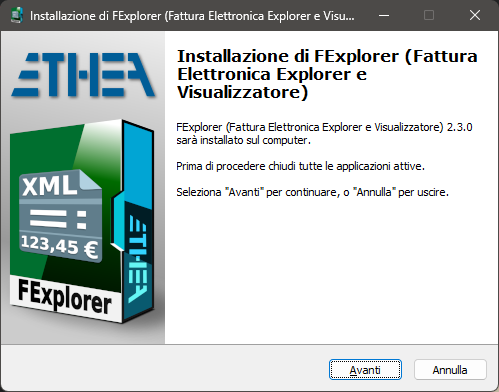
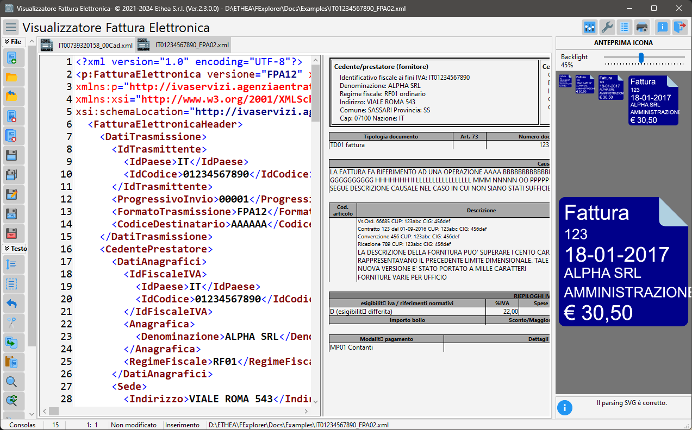

# FExplorer (Fattura Elettronica in Windows Explorer) 

## **Anteprima Fattura Elettronica (Viewer e Icone) integrato in Windows Explorer e Visualizzatore**

**Una serie di strumenti per gestire i file xml contenenti Fatture Elettroniche in Windows:**

- Un [Preview handler][1]  che permette di vedere una anteprima della Fattura Elettronica nel "Pannello Anteprima" di Windows Explorer.

- Un [Thumbnail handler][2] che permette di vedere l'anteprina delle F.E. come icone dentro Windows Explorer

- Un [Visualizzatore][10] di F.E. che permette di visualizzarla in formati diversi e stamparla

### Funzionalità
- Possibilità di definire liberamente un "template" per il disegno dell'icona
- Possibilità di associare colori diversi alle icone in base ai tipi di F.E. o ad altre regole
- Supporta Windows Vista, 7, 8 and 10 (sia 32 bit che 64 bit).
- Supporto dei temi (Scuro o Chiaro) in accordo con le preferenze dell'utente in Windows

### Installazione semplice

Clicca per scaricare il Setup: [FExplorerSetup.exe][3] (che si trova anche nella "release area").

ATTENZIONE: attualmente il setup non è firmato, quindi Windows avvisa che potrebbe essere malevolo.

### Pannello Preview e Anteprima Icone in azione ###

Con Windows 10 e tema scuro:

### Visualizzatore della Fattura Elettronica

Un comodo visualizzatore della fattura elettronica per poterla anche stampare.

### Build e Installazione manuale (per sviluppatori Delphi) ###

Se hai Delphi 10.4 Sydney, puoi compilare manualmente il progetto.

## Compilazione/Installazione packages di componenti di terze parti ##

Utilizzare il file {FExplorer}\Ext\AllPackagesGroup.groupproj per caricare nell'IDE tutti i package da compilare e installare

Utilizzare il file {FExplorer}\Source\FExplorerGroup.groupproj per caricare nell'IDE i 2 progetti da compilare

Per installare manualmente FExplorer.dll seguire questi step:

1. Chiudere tutte le istanze di Windows Explorer in cui è attivo il gestore di anteprima o è stato utilizzato il gestore di anteprima (ricorda che la dll rimane in memoria fino alla chiusura di Windows Explorer).

2. Se hai già utilizzato il programma di installazione, disinstallare i componenti dal sistema.

3. Per installare manualmente la dll modificare opportunamente il file `Setup \ Register64bit.bat` ed eseguirlo (run-as-administrator).

4. Se si desidera disinstallare la dll, modificare opportunamente il file Setup \ UnRegister64Bit.bat` ed eseguirlo.

5. Una volta registrato, puoi continuare a modificare il codice e ricompilare la dll (attenzione a chiudere tutte le istanze di Explorer ogni volta che si ricompila).

## Release Notes ##

23 Apr 2021
- Versione 1.1.0

Thumbnails:
- preview anche delle fatture elettroniche semplificate
- preview di una generica icona XML per i file che non sono fatture

FExplorer:
- default apertura file "read-only"
- Settings: 
  - possibilità di abilitare l'editing dei file
  - possibilità di caricare anche file xsl
  - auto-riconoscimento xsl di trasformazione fatture*
  - auto-riconoscimento xsl di trasformazioni icone svg*

*queste due funzioni permettono di utilizzare l'editor per testare nuovi stili di trasformazione di fatture e di icone

Bug-fixing:
- impostazione stampante (AV in apertura)
- preview di stampa corretta
- alcuni messaggi in inglese

14 Apr 2021
- Versione 1.0.0

26 Mar 2021
- Creazione Repo

## Credits

Grazie a ** Rodrigo Ruz V. ** (autore di [theroadtodelphi.com][7] Blog) per il suo ottimolavoro su [delphi-preview-handler][8] da cui questo progetto ha usato codice e ispirazione.

Grazie a ** Carlo Barazzetta ** per il suo ottimo lavoro su [SvgShellExtensions][13] da cui questo progetto ha usato molto codice e ispirazione.

Grazie ad ** Andrea Magni ** che ha collaborato alla realizzazione di questo progetto.

## Licenza

Rilasciato sotto licenza [Apache License, Version 2.0][9] (the "License");

A meno che non sia richiesto dalla legge applicabile o concordato per iscritto, il software distribuito in base alla Licenza è distribuito "COSÌ COM'È", SENZA GARANZIE O CONDIZIONI DI ALCUN TIPO, esplicite o implicite. Vedere la Licenza per la lingua specifica che regola le autorizzazioni e le limitazioni ai sensi della Licenza.

Related links: [embarcadero.com][11] - [learndelphi.org][12]

[1]: https://docs.microsoft.com/en-us/windows/win32/shell/preview-handlers
[2]: https://docs.microsoft.com/en-us/windows/win32/shell/thumbnail-providers
[3]: https://github.com/EtheaDev/FExplorer/releases/latest/download/FExplorerSetup.exe
[4]: https://github.com/EtheaDev/SVGIconImageList
[5]: https://github.com/SynEdit/SynEdit
[6]: https://github.com/RRUZ/vcl-styles-utils
[7]: https://theroadtodelphi.com/
[8]: https://github.com/RRUZ/delphi-preview-handler
[9]: https://opensource.org/licenses/Apache-2.0
[10]: https://github.com/EtheaDev/FExplorer/wiki/Using-The-SVG-Text-Editor
[11]: https://www.embarcadero.com/
[12]: https://learndelphi.org/
[13]: https://github.com/EtheaDev/SVGShellExtensions/

